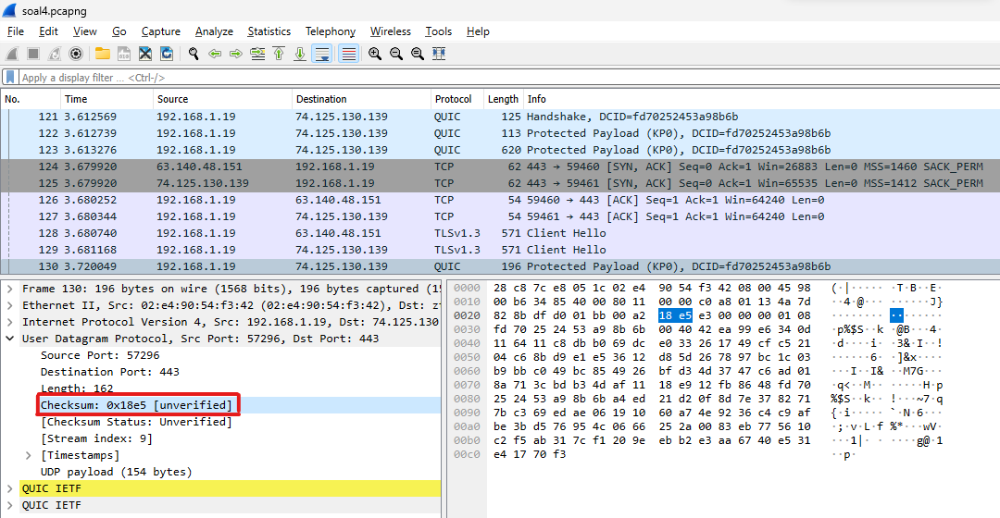
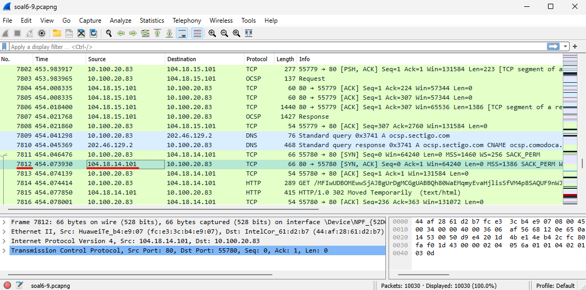
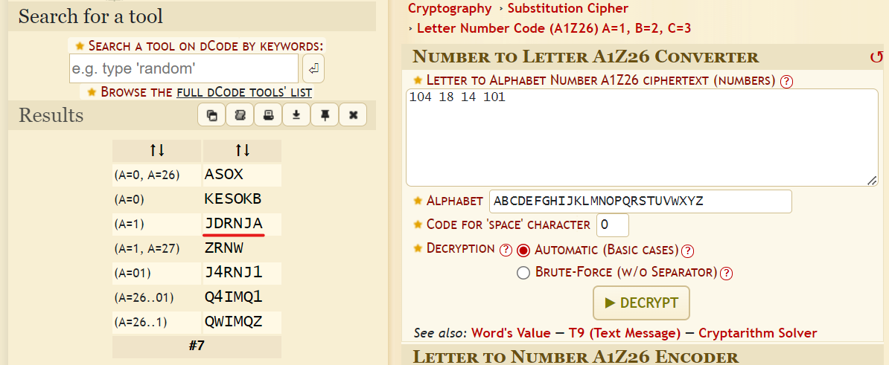
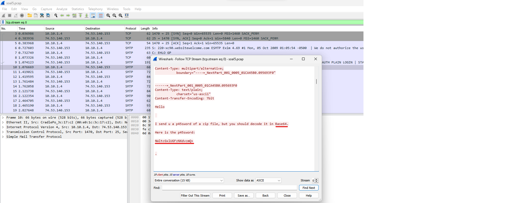
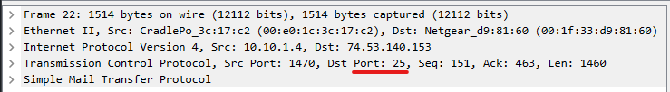

# **Lapres Praktikum Jarkom Modul 1 Kelompok D15**
### **Anggota Kelompok**
|**Nama**|**NRP**|
|--------|-------|
|Rayhan Arvianta Bayuputra      |5025211217|
|Yehezkiel Wiradhika            |5025201086|

## Daftar Isi

1. [Addressing](#addressing)
    1. [Soal 1](#soal-1)
    2. [soal 4](#soal-4)
    3. [soal 6](#soal-6)
2. [Stream](#stream)
    1. [Soal 2](#soal-2)
    2. [Soal 10](#soal-10)
3. [Analysis](#Analysis)
    1. [Soal 3](#soal-3)
    2. [Soal 5](#soal-5)
4. [Filtering](#filtering)
    1. [Soal 7](#soal-7)
    2. [soal 8](#soal-8)
    3. [soal 9](#soal-9)

## Addressing 
### Soal-1

### Soal-4
**Berapa nilai checksum yang didapat dari header pada paket nomor 130?**

_Solusi_

Untuk mendapatkan nilai checksum yang didapat dari header pada paket nomor 130, kita akan mengakses paket tersebut dan langsung lihat header di bagian UDPnya.

Dari situ kita dapatkan nilai _checksum_ nya adalah <ins>**0x18e5**<ins>

### Soal-6
**Seorang anak bernama Udin Berteman dengan SlameT yang merupakan seorang penggemar film detektif. sebagai teman yang baik, Ia selalu mengajak slamet untuk bermain valoranT bersama. suatu malam, terjadi sebuah hal yang tak terdUga. ketika udin mereka membuka game tersebut, laptop udin menunjukkan sebuah field text dan Sebuah kode Invalid bertuliskan _"server SOURCE ADDRESS 7812 is invalid"_. ketika ditelusuri di google, hasil pencarian hanya menampilkan a1 e5 u21. jiwa detektif slamet pun bergejolak. bantulah udin dan slamet untuk menemukan solusi kode error tersebut.**

_Solusi_

Setelah memikirkan teka-teki pada soal tersebut, terdapat poin-poin penting berikut:
- Terdapat Cipher berjenis substitusi a1z26 Cipher
- Rentang huruf yang digunakan pada hasil cipher adalah huruf A-R, 1-18 dengan jawaban 6 huruf.
- Cek source IP pada paket 7812 dari file pcap

Dari situ terlihat bahwa source IP pada paket 7812 adalah <ins>104.18.14.101<ins>

Setelah itu apabila kita buka  <a href="https://www.dcode.fr/letter-number-cipher">_a1z26 cipher decoder_</a>, dan masukkan nomor-nomor pada IPnya, akan didapat jawabannya.

Dapat dilihat bahwa hasil decode cipher dari source IP pada paket 7812 beragam, namun ambil yang hasilnya 6 huruf dan didapat bahwa jawabannya adalah _**JDRNJA**_.

## Stream
### Soal-2

### Soal-10

## Analysis
### Soal-3

### Soal-5
**Elshe menemukan suatu file packet capture yang menarik. Bantulah Elshe untuk menganalisis file packet capture tersebut.**

**a. Berapa banyak packet yang berhasil di capture dari file pcap tersebut?**

**b. Port berapakah pada server yang digunakan untuk service SMTP?**

**c. Dari semua alamat IP yang tercapture, IP berapakah yang merupakan public IP?**

_Solusi_

Untuk mengunlock locked zip yang terdapat pada portal praktikum (berisi netcat untuk menjawab pertanyaan soal ini), kita harus mencari passwordnya yang terletak pada paket yang terdapat di pcap file soal 5.

Setelah kita follow TCP Stream dari salah satu paket yang ada, terlihat bahwa passwordnya adalah **NWltcGxlUGFzNXdvcmQ=** yang apabila didecode dalam Base64 akan menjadi _5implePas5word_

Setelahnya kita akan menjawab pertanyaan-pertanyaan yang terdapat pada soal

- **Berapa banyak packet yang berhasil di capture dari file pcap tersebut?**

Terdapat **60** paket yang berhasil dicapture dari file pcap tersebut.

- **Port berapakah pada server yang digunakan untuk service SMTP?**

Port pada server yang digunakan untuk service SMTP adalah port **25**

- **Dari semua alamat IP yang tercapture, IP berapakah yang merupakan public IP?**

    IP public adalah IP yang selain 
    - 10.0.0.0 — 10.255.255.255
    - 172.16.0.0 — 172.31.255.255
    - 192.168.0.0 — 192.168.255.255

    Dari file pcap didapat IP yang merupakan IP public adalah <ins>**74.53.140.153**<ins>

## Filtering
### Soal-7

### Soal-8

### Soal-9
