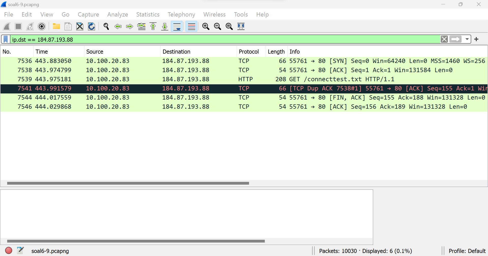

# **Lapres Praktikum Jarkom Modul 1 Kelompok D15**

### **Anggota Kelompok**

| **Nama**                  | **NRP**    |
| ------------------------- | ---------- |
| Rayhan Arvianta Bayuputra | 5025211217 |
| Yehezkiel Wiradhika       | 5025201086 |

## Daftar Isi

1. [Addressing](#addressing)
   1. [Soal 1](#soal-1)
   2. [soal 4](#soal-4)
   3. [soal 6](#soal-6)
2. [Stream](#stream)
   1. [Soal 2](#soal-2)
   2. [Soal 10](#soal-10)
3. [Analysis](#Analysis)
   1. [Soal 3](#soal-3)
   2. [Soal 5](#soal-5)
4. [Filtering](#filtering)
   1. [Soal 7](#soal-7)
   2. [soal 8](#soal-8)
   3. [soal 9](#soal-9)

## Addressing :mailbox:

### Soal-1

**User melakukan berbagai aktivitas dengan menggunakan protokol FTP. Salah satunya adalah mengunggah suatu file.**

_Solusi_

Dari soal di atas kita tahu bahwa kita akan melakukan filter terhadap display filter yang memiliki tipe protokol FTP (File Transfer Protocol) dari kata kunci "mengunggah suatu file" kemudian kita juga akan memfilter dari hasil filter protokol FTP tersebut kata kunci untuk mengupload / mengunggah suatu file, yakni "STOR" yang merupakan perintah upload file.

Berikut merupakan langkah pengerjaannya:

Buka wireshark kemudian buka file soal1.pcapng


maka akan muncul tampilan sebagai berikut


Kemudian lakukan display filter dengan kata kunci "ftp" untuk memfilter response-request bertipe ftp


setelah itu dari hasil display filter ftp, kita melakukan search packet list dengan keyword "STOR" yang menandakan pengunggahan suatu file


<strong>soal poin a</strong>: Berapakah sequence number (raw) pada packet yang menunjukkan aktivitas tersebut?

dari paket tersebut, kita analisis sequence numbernya di layer TCP (Transport Control Protocol)


kita akan mendapat sequence number (raw) dari packet tersebut


setelah kita membuka netcat soal akan muncul pertanyaan dan jika kita jawab soal poin a dengan sequence number (raw) yang kita dapatkan di atas, maka akan muncul sebagai tampilan berikut


<strong>soal poin b</strong>: Berapakah acknowledge number (raw) pada packet yang menunjukkan aktivitas tersebut?

dari TCP layer yang kita lihat sebelumnya, kita juga akan mendapat acknowledge number (raw) sebagai berikut:


<strong>soal poin c</strong>: Berapakah sequence number (raw) pada packet yang menunjukkan response dari aktivitas tersebut?

dari packet 147 (yang merupakan packet yang mengandung request file menggunakan protokol ftp) kita dapat melihat packet response request tersebut tepat di bawahnya (setelah kita melakukan filter ftp), yakni packet 149.


Hal ini dapat kita konfirmasi dengan melihat source dan destination kedua packet yang saling matching sebagai berikut:


dari situ kita akan mendapat sequence number (raw) nya dengan melihat pada layer tcp packet tersebut di bagian sequence number (raw) dan apabila kita mengechecknya menggunakan netcat pada poin c, kita akan mendapatkan hasil sebagai berikut:


<strong>soal poin d</strong>: Berapakah acknowledge number (raw) pada packet yang menunjukkan response dari aktivitas tersebut?

apabila kita melihat ack number dari packet tersebut, kita akan mendapatkan value sebagai berikut:


dan apabila kita mengechecknya dengan netcat:


voila! Kita mendapatkan correct answer dan flagnya.

### Soal-4

**Berapa nilai checksum yang didapat dari header pada paket nomor 130?**

_Solusi_

Untuk mendapatkan nilai checksum yang didapat dari header pada paket nomor 130, kita akan mengakses paket tersebut dan langsung lihat header di bagian UDPnya.

Dari situ kita dapatkan nilai _checksum_ nya adalah <ins>**0x18e5**<ins>

### Soal-6

**Seorang anak bernama Udin Berteman dengan SlameT yang merupakan seorang penggemar film detektif. sebagai teman yang baik, Ia selalu mengajak slamet untuk bermain valoranT bersama. suatu malam, terjadi sebuah hal yang tak terdUga. ketika udin mereka membuka game tersebut, laptop udin menunjukkan sebuah field text dan Sebuah kode Invalid bertuliskan _"server SOURCE ADDRESS 7812 is invalid"_. ketika ditelusuri di google, hasil pencarian hanya menampilkan a1 e5 u21. jiwa detektif slamet pun bergejolak. bantulah udin dan slamet untuk menemukan solusi kode error tersebut.**

_Solusi_

Setelah memikirkan teka-teki pada soal tersebut, terdapat poin-poin penting berikut:

- Terdapat Cipher berjenis substitusi a1z26 Cipher
- Rentang huruf yang digunakan pada hasil cipher adalah huruf A-R, 1-18 dengan jawaban 6 huruf.
- Cek source IP pada paket 7812 dari file pcap


Dari situ terlihat bahwa source IP pada paket 7812 adalah <ins>104.18.14.101<ins>

Setelah itu apabila kita buka <a href="https://www.dcode.fr/letter-number-cipher">_a1z26 cipher decoder_</a>, dan masukkan nomor-nomor pada IPnya, akan didapat jawabannya.


Dapat dilihat bahwa hasil decode cipher dari source IP pada paket 7812 beragam, namun ambil yang hasilnya 6 huruf dan didapat bahwa jawabannya adalah _**JDRNJA**_.

## Stream :wavy_dash:	

### Soal-2

**Sebutkan web server yang digunakan pada portal praktikum Jaringan Komputer!**

_Solusi_

Dari situ kita tahu bahwa web portal merupakan suatu file html yang terdapat pada protokol HTTP, sehingga kita akan melakukan display filter HTTP pada soal ini

Langkah pengerjaan:

pertama, buka soal2.pcapng, kemudian kita lakukan display filter HTTP sebagai berikut:


setelah itu, kita lakukan search <strong>packet list</strong> "GET / HTTP/1.1" untuk mendapatkan <strong>request packet</strong> web portal, karena website portal biasanya bertipe request GET dan root folder "/" sebagai berikut:


dari ip yang didapatkan sebagai berikut:


kita kemudian melakukan filter ip destination dari request tersebut tetapi kita memfilter ip souce disini karena kita menginginkan response dari ip tersebut, sebagai berikut:


dari hasil filter tersebut, kita menemukan beberapa response, tapi yang kita inginkan merupakan response yang memiliki tipe file text/html karena web portal merupakan sebuah website bertipe file html


Dari situ, apabila kita membuka layer HTTP dari paket tersebut (paket 1092 [mengandung website portal]) kita akan melihat server yang digunakan packet tersebut


apabila kita mengetesnya menggunakan netcat, kita akan mendapatkan flagnya


### Soal-10

**Sebutkan kredensial yang benar ketika user mencoba login menggunakan Telnet**

_Solusi_

Mencari kredensialnya dapat melalui paket yang berisi user melakukan login, dengan melakukan query filtering
```
telnet contains "Login"
```


Kemudian follow TCP Stream


Disitu tertera infomasi mengenai login dengan kredensial login ``ddhhaaffiinn`` (aslinya hanya dhafin) dan password ``kesayangannyak0k0``.


## Analysis :nerd_face:

### Soal-3

**Dapin sedang belajar analisis jaringan. Bantulah Dapin untuk mengerjakan soal berikut**

_Solusi_

hal yang pertama kita lakukan adalah membuka soal3.pcapng menggunakan wireshark kemudian membuka netcat program yang telah disediakan melalui terminal linux

<strong>soal poin a</strong>: Berapa banyak paket yang tercapture dengan IP source maupun destination address adalah 239.255.255.250 dengan port 3702

dari poin di atas kita melakukan display filter sebagai berikut

```
ip.addr == 239.255.255.250 && (tcp.port == 3702 or udp.port == 3702)
```

penjelasan dari filter diatas adalah kita mengcapture semua ip yang berasal dan menuju ke port <code>239.255.255.250</code> dengan filter <code>ip.addr == 239.255.255.250</code> kemudian karena kita menginginkan kondisi dimana filter mencakup filtter ip address sebelumnya dan yang menuju ke port 3702 dan karena hanya terdapat 2 macam transport layer dari port, yakni tcp dan udp kita mengcapture semua kemungkinan yang ada dengan <code>tcp.port == 3702 or udp.port == 3702</code> dan menggabungkannya menjadi seperti sebagai berikut:


dari situ kita harus melihat ke bagian bawah tampilan wireshark dan kita akan mendapatkan sebagai berikut:


apabila kita mengechecknya menggunakan program netcat pada poin a akan didapat hasil sebagai berikut:


<strong>soal poin b</strong>: Protokol layer transport apa yang digunakan?

Dari filter, kita hanya mendapatkan paket2 yang ber protokol UDP


apabila kita mengecheck jawaban tersebut dengan netcat kita akan mendapatkan flagnya:


### Soal-5

**Elshe menemukan suatu file packet capture yang menarik. Bantulah Elshe untuk menganalisis file packet capture tersebut.**

**a. Berapa banyak packet yang berhasil di capture dari file pcap tersebut?**

**b. Port berapakah pada server yang digunakan untuk service SMTP?**

**c. Dari semua alamat IP yang tercapture, IP berapakah yang merupakan public IP?**

_Solusi_

Untuk mengunlock locked zip yang terdapat pada portal praktikum (berisi netcat untuk menjawab pertanyaan soal ini), kita harus mencari passwordnya yang terletak pada paket yang terdapat di pcap file soal 5.

Setelah kita follow TCP Stream dari salah satu paket yang ada, terlihat bahwa passwordnya adalah **NWltcGxlUGFzNXdvcmQ=** yang apabila didecode dalam Base64 akan menjadi _5implePas5word_

Setelahnya kita akan menjawab pertanyaan-pertanyaan yang terdapat pada soal

- **Berapa banyak packet yang berhasil di capture dari file pcap tersebut?**
  
  
    Terdapat **60** paket yang berhasil dicapture dari file pcap tersebut.

- **Port berapakah pada server yang digunakan untuk service SMTP?**
  
  
    Port pada server yang digunakan untuk service SMTP adalah port **25**

- **Dari semua alamat IP yang tercapture, IP berapakah yang merupakan public IP?**

  IP public adalah IP yang selain

  - 10.0.0.0 — 10.255.255.255
  - 172.16.0.0 — 172.31.255.255
  - 192.168.0.0 — 192.168.255.255

  Dari file pcap didapat IP yang merupakan IP public adalah <ins>**74.53.140.153**<ins>

## Filtering :checkered_flag:

### Soal-7

**Berapa jumlah packet yang menuju IP 184.87.193.88?**

_Solusi_

Untuk mendapatkan jumlah paket yang menuju ke ip tersebut, dapat dilakukan filtering dengan syntax
```
ip.dst == 184.87.193.88
```


Dapat dilihat bahwa terdapat **6** paket yang menuju ke IP ``184.87.193``.


### Soal-8

**Berikan kueri filter sehingga wireshark hanya mengambil semua protokol paket yang menuju port 80! (Jika terdapat lebih dari 1 port, maka urutkan sesuai dengan abjad)!**

_Solusi_

hal yang pertama dilakukan adalah membuka file soal6-9.pcapng dengan menggunakan wireshark dan membuka program netcat yang telah disediakan menggunakan linux terminal

kemudian kita melakukan display filter pada wireshark dengan query sebagai berikut:

```
tcp.dstport == 80 || udp.dstport == 80
```

penjelasan dari filter tersebut adalah kita melakukan filter packet yang menuju port baik dengan tipe transfer protokol udp <code>udp.dstport == 80</code> maupun tcp <code>tcp.dstport == 80</code> karena kita harus mengurutkannya sesuai abjad (t terlebih dahulu sebelum u) dan menggabungkan hasil kedua query dengan <code>||</code> dihasilkanlah query sebagai berikut:


apabila kita memeriksanya menggunakan netcat, kita akan mendapatkan flagnya:


### Soal-9

**Berikan kueri filter sehingga wireshark hanya mengambil paket yang berasal dari alamat 10.51.40.1 tetapi tidak menuju ke alamat 10.39.55.34!**

_Solusi_

hal yang pertama dilakukan adalah membuka file soal6-9.pcapng dengan menggunakan wireshark dan membuka program netcat yang telah disediakan menggunakan linux terminal

kita lakukan query sebagai berikut:

```
ip.src == 10.51.40.1 && ip.dst != 10.39.55.34
```

penjelasan dari query tersebut adalah kita memfilter semua packets yang berasal dari ip 10.51.40.1 dengan query <code>ip.src == 10.51.40.1</code> tetapi tidak dari ip 10.39.55.34 dengan query <code>ip.dst != 10.39.55.34</code> karena keduanya harus dipenuhi, maka kita menggunakan logical operator <code>&&</code> sehingga didapatkan query sebagai berikut:


apabila kita memeriksanya menggunakan netcat, kita akan mendapatkan flagnya:


